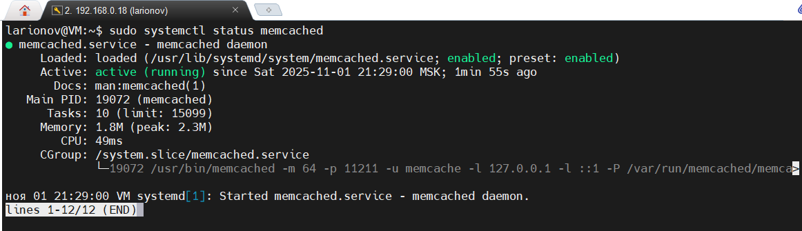
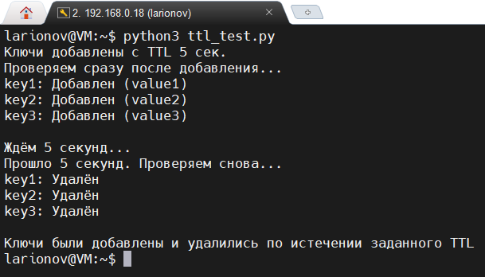
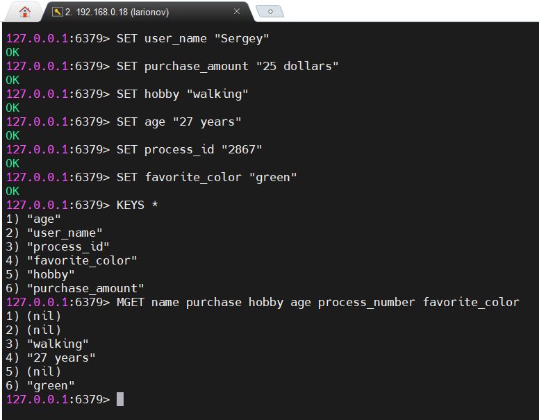

# <p align="center">Домашнее задание к занятию "Кеширование Redis/memcached"</p>

**SYSDB-46 / Ларионов Сергей**

---

### <p align="center">Задание 1: Примеры проблем, которые может решить кеширование</p>

**Кеширование** — это мощный инструмент для оптимизации производительности приложений, особенно в веб-разработке, базах данных и системах с высокой нагрузкой. Оно позволяет хранить часто используемые данные в быстрой памяти (например, RAM), чтобы избежать повторных дорогостоящих операций. Вот несколько примеров проблем, которые кеширование может решить, в свободной форме:

**Снижение нагрузки на базу данных:** Представьте сайт с тысячами пользователей, которые постоянно запрашивают одни и те же данные (например, список товаров в интернет-магазине). Без кеша каждый запрос будет "бить" по базе, что может привести к замедлению или даже падению сервера под нагрузкой. Кеш (типа Redis или Memcached) хранит результаты запросов на 5-10 минут, возвращая их мгновенно и разгружая БД.

**Ускорение веб-страниц и API:** Если ваше приложение делает внешние вызовы (например, к API погоды или курса валют), каждый запрос может занимать секунды из-за сетевой задержки. Кеширование результатов на короткий срок (TTL) позволяет отдавать данные из памяти, делая сайт молниеносным для пользователей.

**Оптимизация вычислений:** В научных или финансовых приложениях (например, расчёты рисков в вашей строительной компании) повторные сложные вычисления (типа прогнозирования бюджета) могут "съедать" CPU. Кеш сохраняет результаты, так что следующий запрос использует готовый ответ, экономя ресурсы и время.

**Обработка пиковых нагрузок:** Во время "всплесков" трафика (например, чёрная пятница в e-commerce) кеш предотвращает перегрузку серверов, кэшируя статические ресурсы (изображения, CSS) или динамические данные. Без него сайт может "лечь", теряя клиентов.

**Снижение сетевых затрат:** В распределённых системах (как ваша логистика с CockroachDB) кеш на клиенте или прокси (например, Varnish) уменьшает трафик между серверами, экономя bandwidth и деньги на облаке.

В общем, кеширование решает проблемы производительности, масштабируемости и стоимости, но важно настраивать TTL (время жизни), чтобы данные не устаревали. В ваших примерах с СУБД оно могло бы ускорить запросы к PostgreSQL для бюджетирования! 

---

## <p align="center">Задание 2: Установка и запуск Memcached</p>

Установка Memcached: *sudo apt install memcached*
Запуск сервиса: sudo *systemctl start memcached*
Включение автозапуска: *sudo systemctl enable memcached*

#### Проверка статуса: *sudo systemctl status memcached*


Скриншот: Статус Memcached

---

## <p align="center">Задание 3: Удаление по TTL в Memcached</p>

В данном задании возникли небольшие трудности и очень затратные по времени, по причине тестирования TTL в Memcached используя telnet и соответсвенно переход к автоматизации с Python. (Стоит отметить, что заданием это не запрещено).

Заметил проблему при ручном тестировании TTL (времени жизни ключей) в Memcached с помощью telnet. Memcached использует lazy expiration — ключи удаляются только при следующем доступе к ним, с гранулярностью 1 секунда. При ручном вводе команд в telnet возникают задержки (1-2 секунды на ввод "add" и "get"), что приводит к тому, что ключи с коротким TTL (<20 секунд) истекают мгновенно, даже если TTL установлен правильно. В реальном использовании (в коде) это не проблема, но в ручном тесте симулирует преждевременное истечение.

Лог telnet (пример с TTL от 5 до 30 секунд), что получалось у меня через терминал:

```bash
larionov@VM:~$ telnet localhost 11211
Trying 127.0.0.1...
Connected to localhost.
Escape character is '^]'.
add key1 0 5 5
value
STORED
get key1
END
add key2 0 10 5
value
STORED
get key2
END
add key3 0 15 5
value
STORED
get key3
END
add key4 0 20 5
value
STORED
get key4
VALUE key4 0 5
value
END
get key4
END
add key5 0 25 5
value
STORED
get key5
VALUE key5 0 5
value
END
get key5
END
add key6 0 30 5
value
STORED
get key6
VALUE key6 0 5
value
END
get key6
END
```

Соответсвенно после множества неудачных попыток был написан скрипт ttl_test.py:

```bash
else: print("key3: Не найден")

# Ждём ровно 5 секунд
print("\nЖдём 5 секунд...")
time.sleep(5)
print("Прошло 5 секунд. Проверяем снова...")

# Проверяем после истечения TTL
value1_after = client.get('key1')
value2_after = client.get('key2')
value3_after = client.get('key3')
if value1_after: print(f"key1: Ещё здесь ({value1_after.decode('utf-8')})")
else: print("key1: Удалён")
if value2_after: print(f"key2: Ещё здесь ({value2_after.decode('utf-8')})")
else: print("key2: Удалён")
if value3_after: print(f"key3: Ещё здесь ({value3_after.decode('utf-8')})")
else: print("key3: Удалён")

print("\nКлючи были добавлены и удалились по истечении заданного TTL")
```
Который не только продемонстрировал запись ключей, но и то, что спустя 5 секунд ключи удалились из базы, что и требовалось по заданию.


Скриншот: Удаление ключей по TTL в Memcached

---

## <p align="center">Задание 4: Запись данных в Redis</p>

Обновление системы: sudo apt update.
Установка Redis: sudo apt install redis-server.
Запуск сервера: sudo systemctl start redis-server.
Проверка статуса: sudo systemctl status redis-server.
В терминале подключиться к: redis-cli.
Появиться строка приветсвия: 127.0.0.1:6379>.
Это интерактивная оболочка для команд Redis.

Далее:
SET: Записывает ключ со значением. Синтаксис: SET key value.
GET (или MGET если в строку для удобства): Получает значение по ключу. Синтаксис: GET key.
*KEYS : Показывает все ключи. Синтаксис: KEYS pattern (звёздочка — wildcard для всех ключей).
Дополнительно можно также добавлять TTL: пример SET temp "test" EX 10 — ключ истечёт через 10 секунд.


Скриншот: redis_keys_list

---